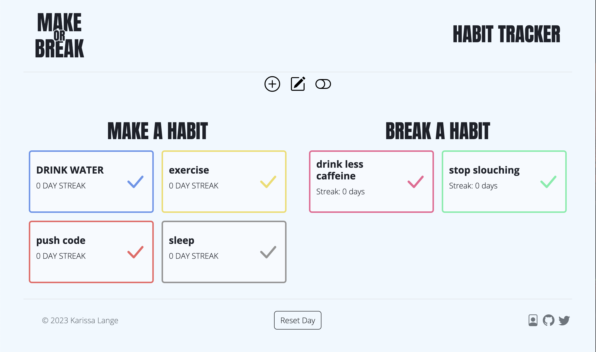
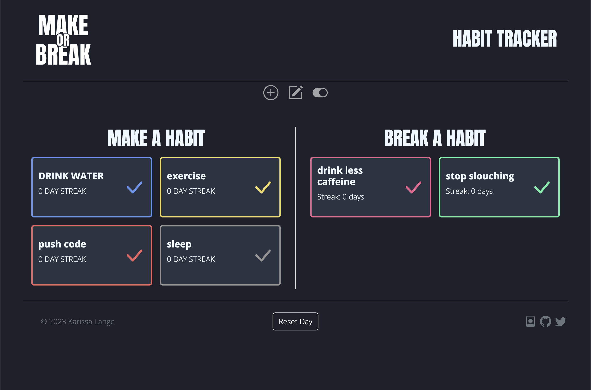

 

  

<h1 align="center">Make or Break Habit Tracker</h1>

    Making good habits and breaking not-so-good habits ☑️
  

  

    <a href="https://makeorbreakhabit.cyclic.app/"><strong>Visit the Make or Break Habit Tracking App »</strong></a>
  

  
Table of Contents

  <ul>
    <li><a href="#about-the-project">About</a></li>
    <li><a href="#built-with">Built With</a></li>
    <li><a href="#roadmap">Road Map</a></li>
    <li><a href="#contact-me">Contact Me</a></li>
  </ul>

## About The Project
Make or Break Habit Tracker allows users to track habits daily and keep records of progress. Users can login to save tracking data through the app's cloud database.

## Built With
![HTML5][html-shield]
![CSS3][css-shield]
![JavaScript][js-shield]
[![Bootstrap][bootstrap-shield]][bootstrap-url]
[![EJS][ejs-shield]][ejs-url]
[![Node.js][node-shield]][node-url]
[![Express][express-shield]][express-url]
[![MongoDB][mongodb-shield]][mongodb-url]
[![Passport][passport-shield]][passport-url]

Make or Break is a full stack web app using the Node.js, Express stack. Data for the app is stored and managed through MongoDB where there are bothuser and habit collections. Passport.js is used for local user login to ensure a safe, encrypted authentication process. 

## Roadmap

- Change dark mode rendering to not involve JS DOM
- Have the day reset at midnight in the user's local time
- Calendar view of tracked habits

## Contact Me

View my Portfolio: [![portfolio][portfolio-shield]][portfolio-url]

Shoot me an Email: ka.lange266@gmail.com

Find me on Twitter: [![twitter][twitter-shield]][twitter-url]

Connect on Linked In: [![linkedIn][linkedin-shield]][linkedin-url]

(<a href="#readme-top">back to top</a>)

<!-- MARKDOWN LINKS & IMAGES -->
<!-- https://www.markdownguide.org/basic-syntax/#reference-style-links -->
[html-shield]: https://img.shields.io/badge/html5-%23E34F26.svg?style=for-the-badge&logo=html5&logoColor=white

[css-shield]: https://img.shields.io/badge/css3-%231572B6.svg?style=for-the-badge&logo=css3&logoColor=white

[js-shield]: https://img.shields.io/badge/javascript-%23323330.svg?style=for-the-badge&logo=javascript&logoColor=%23F7DF1E
[ejs-shield]: https://img.shields.io/badge/EJS-100000?style=for-the-badge&logo=EJS&logoColor=white&labelColor=ffffff&color=B8C972

[bootstrap-shield]: https://img.shields.io/badge/bootstrap-%238511FA.svg?style=for-the-badge&logo=bootstrap&logoColor=white
[bootstrap-url]: https://getbootstrap.com

[tailwind-shield]: https://img.shields.io/badge/tailwindcss-%2338B2AC.svg?style=for-the-badge&logo=tailwind-css&logoColor=white
[tailwind-url]: https://tailwindcss.com/

[express-shield]: https://img.shields.io/badge/express.js-%23404d59.svg?style=for-the-badge&logo=express&logoColor=%2361DAFB
[express-url]: https://expressjs.com/

[node-shield]: https://img.shields.io/badge/node.js-6DA55F?style=for-the-badge&logo=node.js&logoColor=white
[node-url]: https://nodejs.org/en

[mongodb-shield]: https://img.shields.io/badge/MongoDB-%234ea94b.svg?style=for-the-badge&logo=mongodb&logoColor=white
[mongodb-url]: https://www.mongodb.com/

[ejs-shield]:https://img.shields.io/badge/EJS-100000?style=for-the-badge&logo=EJS&logoColor=white&labelColor=B8C972&color=B8C972
[ejs-url]:https://ejs.co/

[passport-shield]: https://img.shields.io/badge/Passport.js-100000?style=for-the-badge&logo=Passport.js&logoColor=FFFFFF&labelColor=FFFFFF&color=80ED84
[passport-url]: https://www.passportjs.org/

[canva-shield]: https://img.shields.io/badge/Canva-%2300C4CC.svg?style=for-the-badge&logo=Canva&logoColor=white
[canva-url]: https://www.canva.com/

[adobeps-shield]:https://img.shields.io/badge/adobe%20photoshop-%2331A8FF.svg?style=for-the-badge&logo=adobe%20photoshop&logoColor=white
[adobeps-url]:https://www.adobe.com/products/photoshop/landpa.html?sdid=KKQIN&mv=search&kw=photoshop&ef_id=Cj0KCQjw9fqnBhDSARIsAHlcQYR9qXBGk9qu_aDS7PDLWhOo3f9376A2DhbkZ_Uza2shfSs7uc-4H9gaAt0pEALw_wcB:G:s&s_kwcid=AL!3085!3!522507805137!e!!g!!adobe%20photoshop!1712238394!67643541820&mv=search&gclid=Cj0KCQjw9fqnBhDSARIsAHlcQYR9qXBGk9qu_aDS7PDLWhOo3f9376A2DhbkZ_Uza2shfSs7uc-4H9gaAt0pEALw_wcB

[linkedin-shield]: https://img.shields.io/badge/linkedin-%230077B5.svg?style=for-the-badge&logo=linkedin&logoColor=white
[linkedin-url]: https://www.linkedin.com/in/ka-lange/

[twitter-shield]: https://img.shields.io/badge/@kl2662-%231DA1F2.svg?style=for-the-badge&logo=Twitter&logoColor=white
[twitter-url]: https://twitter.com/kl2662

[portfolio-shield]:https://img.shields.io/badge/PORTFOLIO-100000?style=for-the-badge&logo=Portfolio&logoColor=white&labelColor=FFFDFC&color=C77D4F
[portfolio-url]: https://karissa-lange.netlify.app/

[email-shield]: https://img.shields.io/badge/Gmail-D14836?style=for-the-badge&logo=gmail&logoColor=white

